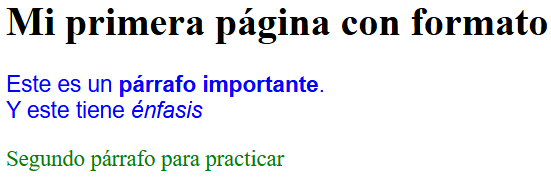

# Actividad uno - Ejercicios en html, css y js.
***
## 18 ejercicios prácticos de trabajos en clase de la materia de programación web.
Actualmente llevo seis ejercicios de los dieciocho que tendremos que realizar.
### Ejercicio uno - Hola mundo
Este ejercicio no fue más que una introducción a las herramientas que usaremos más adelante. Aquí aprendí a como usar un servidor local.
### Ejercicio dos - Párrafos
En este ejercicio aprendí a usar unas nuevas etiquetas en los párrafos y en lo particular yo experimente con el css

